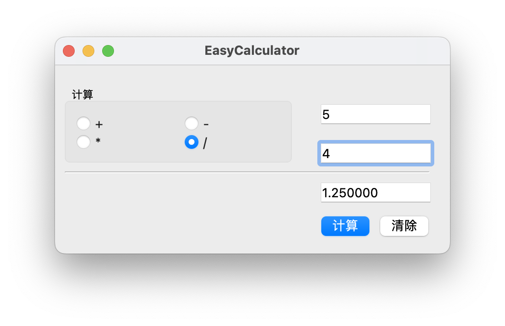
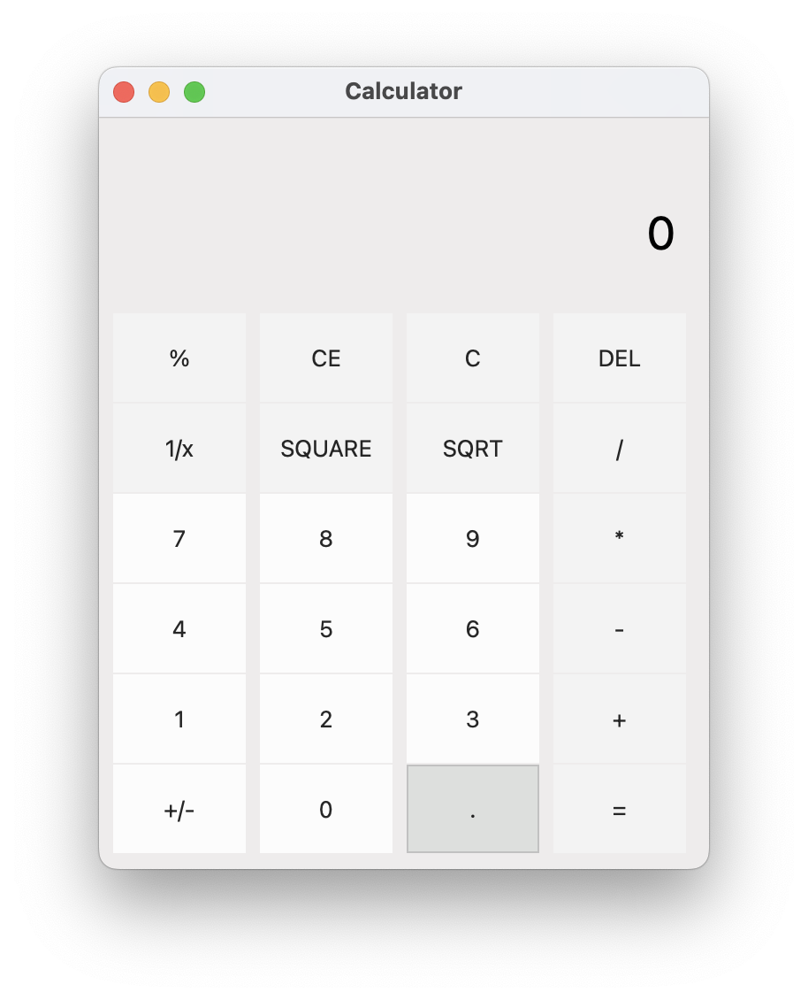
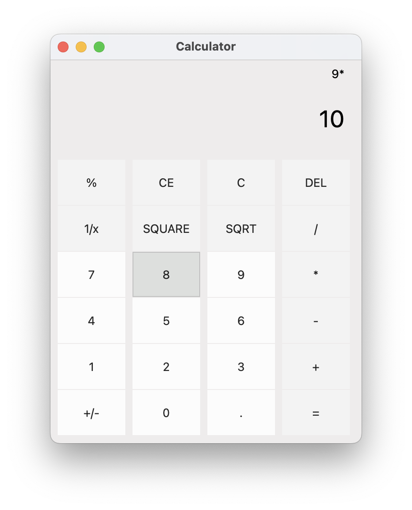
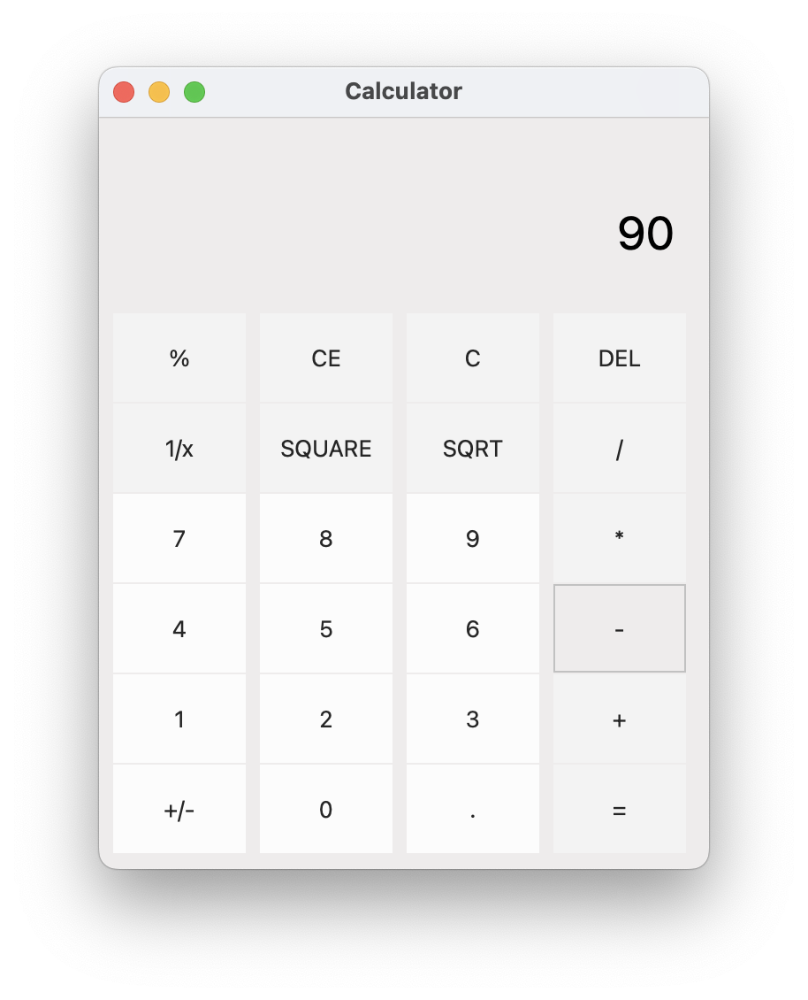

<!--
 * @Author: Frank Chu
 * @Date: 2022-11-25 15:01:51
 * @LastEditors: Frank Chu
 * @LastEditTime: 2022-12-01 19:32:36
 * @FilePath: /Cpp/lab/Cpp-lab02-week12/Calculator/README.md
 * @Description: 
 * 
 * Copyright (c) 2022 by Frank Chu, All Rights Reserved. 
-->

<!-- markdownlint-disable MD033 -->

# 实验二 基于 QT GUI 计算器程序设计

## 实验目的

1. 熟悉 Windows 应用程序开发的基本过程；
2. 学习 Qt 对话框应用程序开发过程；
3. 学习标准控件的使用

实验环境：Qt 6.0/Qt Creator8.0 或以上

## 实验主要原理说明

### Qt常用部件

（提示：列出Qt Designer工具箱内的部件分类，及其中的常用的部件）

* Layouts
* Spacers
* Buttons
  * Push Button
  * Radio Button
* Item Views (Model-Based)
* Item Widgets (Item-Based)
* Containers
  * Group Box
* Input Widgets
  * Line Edit
* Display Widgets
  * Label
  * Text Browser

### 对话框访问部件的方法

1. 双击 dialog.ui，进入对话框编辑器
2. 直接按“运行”按钮，进行构建并运行，得到一空对话框
3. 结束运行，回到设计视图，设定对话框标题，最小及最大高宽度，并在左边的 Widgets 工具箱中把 Label, pushButton 两种 widgets 拖入对话框放好
4. 点运行，将会得到一个大小固定的对话框
5. 回到“设计”视图，点中 PushButton，并在属性页改变其按钮文本
6. 右击按钮，选择“转到槽”菜单项，然后选择信号“clicked()”，点击“确定”
7. 在该“槽”方法中，键入代码

### 基于事件驱动的消息机制简要说明

[基于消息的事件驱动机制 - Tencent Cloud](https://cloud.tencent.com/developer/article/1857333)

基于消息的事件驱动机制是一个通用模型，广泛应用于桌面软件开发、网络应用程序开发、前端开发等技术方向中。可以理解为外部操作事件，被转化为消息存放于队列中；而每种类型的消息都有对应的处理；通过消息循环，完成读消息、调用消息处理这个过程。这个过程，只要应用不退出，会一直进行下去。下图的模型从Windows应用程序而来，但是具有一定的通用性。

### Qt信号与槽通信机制简要说明

Qt 信号与槽机制详解 信号与槽（Signal & Slot） 是 Qt 编程的基础，也是 Qt 的一大创新。 因为有了信号与槽的编程机制，在 Qt 中处理界面各个组件的交互操作时变得更加直观和简单。 信号（Signal） 就是在特定情况下被发射的事件，例如 PushButton 最常见的信号就是鼠标单击时发射的 clicked () 信号，一个 ComboBox 最常见的信号是选择的列表项变化时发射的 CurrentIndexChanged() 信号。 GUI 程序设计的主要内容就是对界面上各组件的信号的响应，只需要知道什么情况下发射哪些信号，合理地去响应和处理这些信号就可以了。 槽（Slot）就是对信号响应的函数。

## 实验内容及实现

### 简易计算器

A、界面设计

（给出界面即可）

<center>
    
</center>

B、主要程序说明

（给出关键槽、成员变量等的处理代码，并加关键注释说明）

1. 简易计算器类 EasyCalculator
2. 计算按钮按下槽 EasyCalculator::on_calculateButton_clicked()
3. 清楚按钮按下槽 EasyCalculator::on_clearButton_clicked()
4. 私有的计算符号 EasyCalculator::op
5. 枚举变量 EasyCalculator::Operation

### 进阶计算器

A、界面设计

（给出界面，并简要说明实现方法）

<!--  -->
<center>
    
</center>

* Buttons -> PushButton
* InputWidgets -> LineEdit
* Grid Layout
* Style Sheet

```cpp
// Style Sheet
* {
border:none;
background-color: rgb(238, 236, 236);
}

QPushButton {
background-color: rgb(243, 243, 243);
}

QPushButton:hover {
border:1px solid rgb(193, 193, 193);
background-color: rbg(221, 223, 221);
}

QPushButton#btn_numSign:hover, #btn_numDot:hover, #btn_num0:hover, #btn_num1:hover, #btn_num2:hover, #btn_num3:hover, #btn_num4:hover, #btn_num5:hover, #btn_num6:hover, #btn_num7:hover, #btn_num8:hover, #btn_num9:hover {
background-color: rgb(221, 223, 221);
}

QPushButton#btn_numSign, #btn_numDot, #btn_num0, #btn_num1, #btn_num2, #btn_num3, #btn_num4, #btn_num5, #btn_num6, #btn_num7, #btn_num8, #btn_num9 {
background-color: rgb(252, 252, 252);
}
```

B、主要程序说明

（给出关键槽、成员变量等的处理代码，并加关键注释说明）

1. 按钮组按下方法 Dialog::onButtonGroupClicked()
2. UI 初始化时将数字按钮组成组，关联按钮组的点击信号 Dialog::iniUI()
3. 前一个按钮输入的符号 OR 数字 Dialog::prevBtn
4. 储存左数右数和符号，进行运算 Dialog::vectorOfNumbersAndSigns

## 程序测试

给出程序测试结果，并简要说明测试过程

```cpp
// 在简单计算器程序进行加减乘除

// 在复杂计算器进行加减乘除
```

<center>
    
</center>

<center>
    
</center>

<center>
    
</center>

## 讨论及心得

比如可以给出如下内容：

1、实验过程中遇到的问题与解决方法

实验中对于 QT 的控件使用有部分问题，通过网络查询，能够了解到具体的使用方法。

2、目前尚未解决的问题

目前进阶计算器在数据结构上可以进一步优化。
