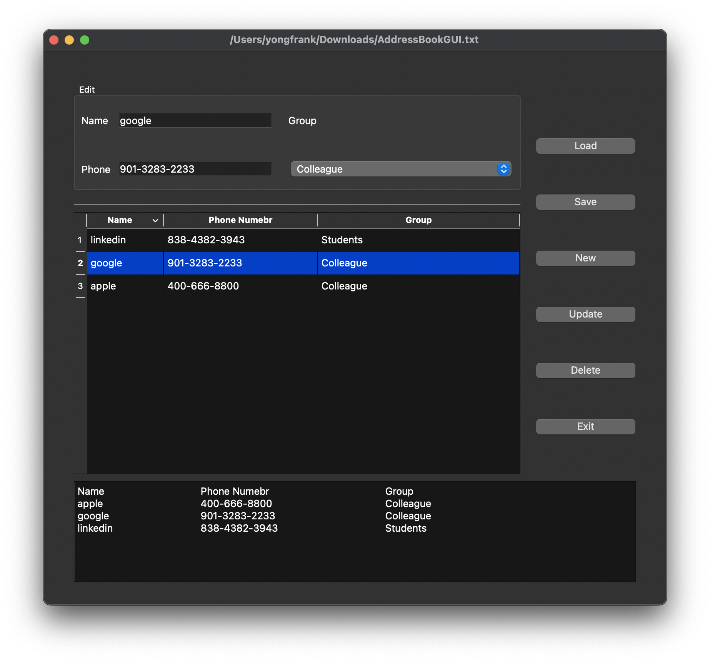
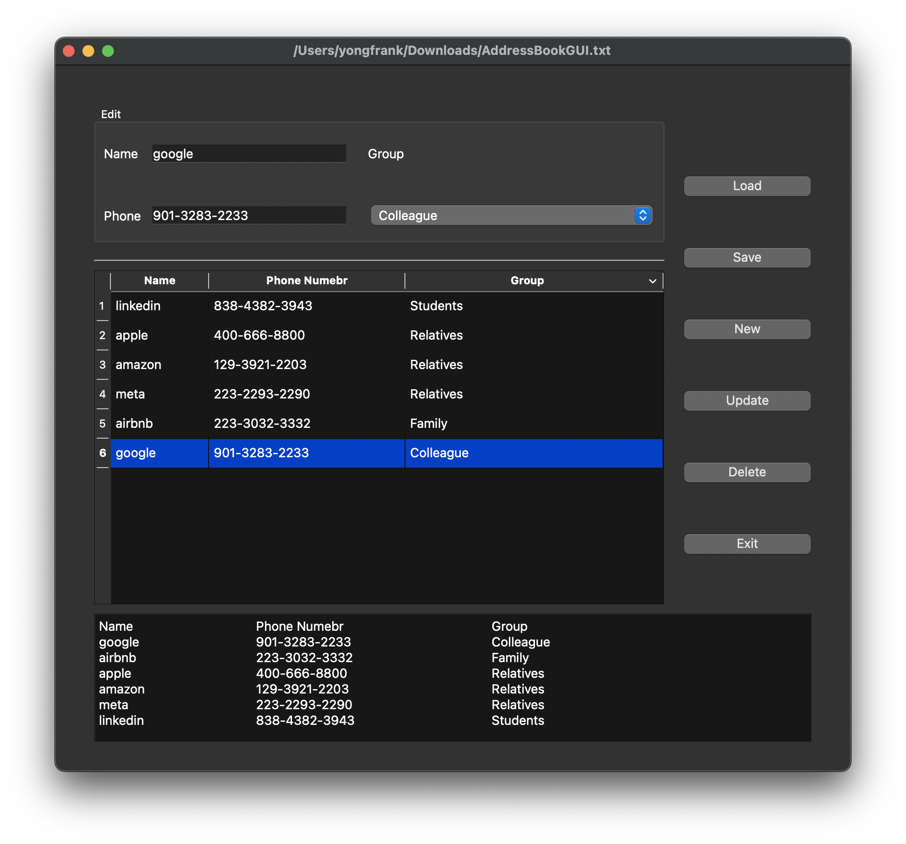

<!--
 * @Author: Frank Chu
 * @Date: 2022-12-13 23:10:27
 * @LastEditors: Frank Chu
 * @LastEditTime: 2022-12-17 03:15:15
 * @FilePath: /Cpp/lab/Cpp-lab03-week14/AddressBookGUI/README.md
 * @Description: 实验三报告-姓名-学号.pdf
 * 
 * Copyright (c) 2022 by Frank Chu, All Rights Reserved. 
-->

<!--markdownlint-disable MD033-->

# 实验三 通信录程序设计

## 一、实验目的

1. 熟悉 Qt 对话框应用程序开发的基本过程；
2. 学习数据驱动标准小部件的使用；
3. 学些文件对话框的使用；
4. 练习较复杂的交互式操作的控制流程；
5. 练习文件输入/输出流的使用。

## 二、实验内容

实现一个具有一定实用价值的通讯录程序

## 三（一）、实验系统设计

从操作逻辑中建立 view (界面对象：按钮，表格，组合框…)和 model（内部数据地址簿类与对象，相关方法，槽函数…）之间的时序逻辑关联，并设计使用槽函数将程序的各种数据结构和方法有机地串联起来。

### 1、通信录程序的框架结构

即给出程序设计架构图（可参考实验指导书上图，说明界面、AddressBook(类)、文件系统三者之间的关系）。

### 2、界面设计

* GroupBox 小部件
* PushButton 小部件
* LineEdit 小部件
* Label 小部件
* QTableWidget 小部件 Qt 为我们提供了两类表格小部件（QTableView 和 QTableWidget）供用户显示二维表。
* 垂直布局（Vertical Layout）在放置完所有按钮后，点选所有按钮，并点击 Vertical Layout 布局按钮进行布局。
* 组合框（Combo Box）一个 ComboBox 相当于一个 LineEdit 和一个 List 组件的结合。用于在一列数据中选择其 中某一项。一个 ComboBox 的数据可以来源于一个 QStringList 对象。

## 三（二）、主要程序说明

### 1、给出关键处理代码，并加以注释说明，必须包含界面上新建、更新、删除对应的功能处理代码

1. void Widget::newButtonSlot() 用于新建联系人，将新建联系人的信息添加到地址簿中，同时在界面上显示出来。
2. void Widget::alterALine() 修改某一行，更新联系人
3. void Widget::deleteARow() 删除一行数据

### 2、若实现了通信录排序功能，请给出相应处理代码，且在程序测试部分，给出测试结果

1. Widget::model QStandardItemModel* model 图示即为姓名降序排序

## 四、 程序测试

给出程序测试结果，并简要说明测试过程

### 测试结果

将文件从 Downloads 路径下读入，然后将数据显示在界面上，然后对界面上的数据进行修改，然后将修改后的数据写入文件中。

## 五、讨论及心得

### 1、实验过程中遇到的问题与解决方法

[qt 里面 `std::sort` 调用别的类里面友元函数当作排序依据显示 Use of undeclared identifier](https://0xffff.one/d/1390-qt-li-mian-std-sort-diao-yong-bie)

> 0x1234 At 0xFFFF搬砖艺术：
>
> lambda 早一点绑定了参数和 customSort，相当于一个闭包给 sort，不全局声明的友元函数对于他是可见的，也可以自己写个函数在类中调用 customSort 就行然后再传给 sort，还有种办法就是把友元函数的定义写在外面。
>
> 然后这里存在参数依赖查找，简称ADL，他会去Contact类里找有没有对应的函数，所以如果参数是其他的不包含Contact就找不到了。

2、目前尚未解决的问题

[qt 里面 `std::sort` 调用别的类里面友元函数当作排序依据显示 Use of undeclared identifier](https://0xffff.one/d/1390-qt-li-mian-std-sort-diao-yong-bie)

3、实验设计思路的创新等

利用 MVC 框架去对数据进行管理，将数据和界面分离，使得数据的管理更加方便。

## 六、Reference

[Qt模型/视图框架（一） - 小豆君编程分享的文章 - 知乎](https://zhuanlan.zhihu.com/p/47402006)

[Qt QStandardItemModel用法（超级详细）](http://c.biancheng.net/view/1869.html)